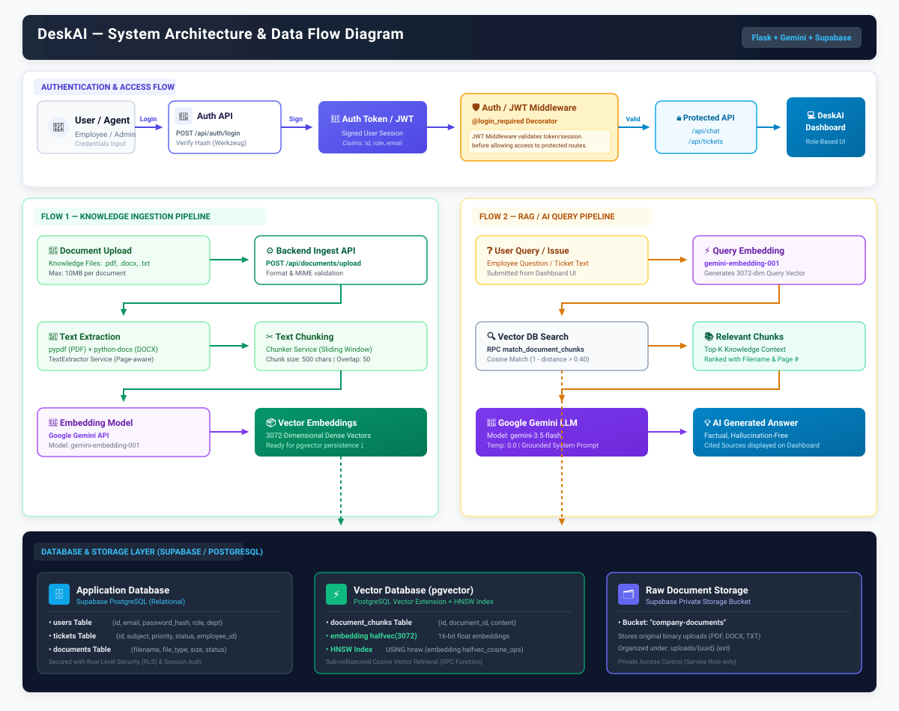

# DeskAI

**DeskAI** is a lightweight, Flask‑based ticket‑management system that combines a classic support workflow with AI‑augmented assistance using Google Gemini. It provides employee ticket submission, an admin dashboard, and a knowledge‑base powered Retrieval‑Augmented Generation (RAG).

---

## Table of Contents
- [Problem Statement](#problem-statement)
- [Solution Overview](#solution-overview)
- [Key Features](#key-features)
- [Architecture & Tech Stack](#architecture--tech-stack)
- [System Architecture](#system-architecture)
- [Project Structure](#project-structure)
- [Setup & Installation (Windows PowerShell)](#setup--installation-windows-powershell)
- [Running the Application](#running-the-application)
- [Running Tests](#running-tests)
- [Environment Variables & Security](#environment-variables--security)
- [Responsive UI](#responsive-ui)
- [Future Improvements (optional)](#future-improvements)

---

## Problem Statement
Small teams often lack an easy‑to‑deploy internal help‑desk that also offers AI‑driven suggestions for ticket resolution.

## Solution Overview
DeskAI delivers a self‑contained Flask backend, a vanilla‑HTML/CSS/JavaScript frontend, and AI support via Google Gemini. Knowledge‑base documents (PDF, DOCX, plain‑text) are ingested and queried through a RAG pipeline.

## Key Features
- Employee ticket creation and personal view.
- Admin dashboard with filtering, sorting, and bulk actions.
- **Mobile‑first ticket cards** (≤ 600 px) that replace the desktop table on narrow viewports (tested at 375 px).
- Success (green) and error (red) alert styling with auto‑hide.
- Supabase/PostgreSQL persistence (configurable via environment variables).
- Google Gemini integration for AI‑generated ticket suggestions.
- Retrieval‑Augmented Generation (RAG) over a structured knowledge base.

## Architecture & Tech Stack
| Layer | Technology |
|-------|------------|
| **Backend** | Flask 3.1.3, Supabase Python client 2.31.0 |
| **AI** | Google Gemini (`google‑genai` 2.19.0) |
| **Frontend** | HTML5, vanilla CSS (custom design), vanilla JavaScript |
| **Database** | Supabase (PostgreSQL) – credentials supplied via environment variables |
| **Testing** | `pytest` 8.2.2 |

## System Architecture



### Key Architectural Components

1. **Authentication & Session Security**:
   - Users authenticate with email and password via `POST /api/auth/login`.
   - Passwords are verified against stored hashes using `werkzeug.security`.
   - A signed Flask session token (`session['user']`) is created to identify role permissions (`employee` vs `admin`).
   - The `@login_required` middleware validates user sessions before granting access to protected API routes (`/api/chat`, `/api/tickets`).

2. **Knowledge Ingestion Pipeline (Flow 1)**:
   - **Document Upload**: Supports `.pdf`, `.docx`, and `.txt` files up to 10 MB via `POST /api/documents/upload`.
   - **Storage**: Raw uploads are archived in a private Supabase Storage bucket (`"company-documents"`).
   - **Text Extraction & Chunking**: `pypdf` and `python-docx` extract text page-by-page, split into 500-character chunks with a 50-character sliding overlap.
   - **Embedding Generation**: Chunks are embedded into 3072-dimensional vectors using Google Gemini (`gemini-embedding-001`).
   - **Vector Persistence**: Embeddings and chunk metadata are saved to the `document_chunks` table in Supabase PostgreSQL.

3. **RAG / AI Query Pipeline (Flow 2)**:
   - **Query Embedding**: Natural language user questions from the dashboard are embedded using Gemini (`gemini-embedding-001`).
   - **Vector Similarity Search**: Cosine distance is queried against the `document_chunks` table using an HNSW index (`halfvec_cosine_ops`) via the `match_document_chunks` RPC function with a default similarity threshold of `0.40`.
   - **Strict Grounded Generation**: Retrieved context is injected into Google Gemini (`gemini-3.5-flash`) with temperature `0.0` and strict system instructions to eliminate hallucinations.
   - **Cited Response**: Grounded answers with cited source documents and page numbers are returned to the DeskAI dashboard UI.

4. **Database & Storage Layer**:
   - **Application Relational Database**: Manages user profiles, role-based access control, ticket lifecycle (`Open`, `Assigned`, `Resolved`), and document statuses.
   - **Vector Database**: Supabase `pgvector` extension with HNSW index for sub-millisecond similarity matching.
   - **Private Object Storage**: Supabase Storage bucket for raw knowledge documents.

> 📐 **Detailed Diagrams**: For sequence diagrams and additional flow specifications, refer to [docs/ARCHITECTURE.md](docs/ARCHITECTURE.md).

## Project Structure
```
DeskAI/
├─ .env.example               # Sample env file – do NOT commit real secrets
├─ .git/                      # Git metadata (already initialized)
├─ .gitignore                # Ignores .env, caches, virtual‑env folders, etc.
├─ app.py                     # Flask entry point
├─ backend/                  # Flask blueprint, config, Supabase client
├─ docs/                     # Architecture & workflow documentation
│   ├─ ARCHITECTURE.md
│   └─ architecture/
│       └─ deskai-architecture.svg
├─ frontend/                 # HTML / CSS / JS assets (admin UI, ticket UI)
├─ knowledge_base/           # Domain folders with plain‑text, PDF, DOCX files
│   ├─ CYBERSECURITY/
│   ├─ HR/
│   ├─ IT_SUPPORT/
│   └─ OFFICE_FINANCE/
├─ migrations/               # Database migration scripts
├─ requirements.txt          # Python dependencies
├─ sample_test.pdf            # Example document for RAG ingestion
├─ tests/                    # Automated test suite
│   ├─ test_ingestion.py
│   └─ test_rag.py
└─ README.md                 # **This file**
```

## Setup & Installation (Windows PowerShell)
```powershell
# 1️⃣ Clone the repository (if you haven't already)
git clone <repository‑url>
cd DeskAI

# 2️⃣ (Optional) Create a virtual environment
python -m venv .venv
.\.venv\Scripts\Activate.ps1   # Activate the venv

# 3️⃣ Install required packages
pip install -r requirements.txt

# 4️⃣ Copy the example env and configure your secrets
Copy-Item .env.example .env
notepad .env   # Edit with your Supabase URL/key and Flask secret key
```

## Running the Application
```powershell
python app.py
# The app will start on http://0.0.0.0:5000 (or the PORT defined in .env)
```

## Running Tests
```powershell
python -m pytest tests -q
# Expected output: 1 passed, 2 skipped
```

## Environment Variables & Security
| Variable | Purpose |
|----------|---------|
| `FLASK_SECRET_KEY` | Flask session secret (keep secret). |
| `SUPABASE_URL` | Supabase project endpoint. |
| `SUPABASE_KEY` **or** `SUPABASE_SECRET_KEY` | Supabase service‑role key (do NOT commit). |
| `PORT` (optional) | Port for the Flask server (default 5000). |

**Never commit** the real `.env` file. The repository’s `.gitignore` already excludes `.env` and related temporary files.

## Responsive UI
- **Desktop (≥ 600 px)** – Admin view shows a sortable ticket table.
- **Mobile (≤ 600 px, verified at 375 px)** – Table is replaced by full‑width ticket cards displaying ID, subject, employee, department, priority, status, creation date, and a ‘View’ button. No horizontal overflow occurs.

---

## Future Improvements (optional)
- Add a CI workflow (GitHub Actions) to run tests on push.
- Integrate a linter (e.g., `ruff`) with a pre‑commit hook.
- Extend AI capabilities (conversation history, fine‑tuning).

---

*All information above reflects the current implementation of DeskAI. No features are claimed beyond what exists in the codebase.*
