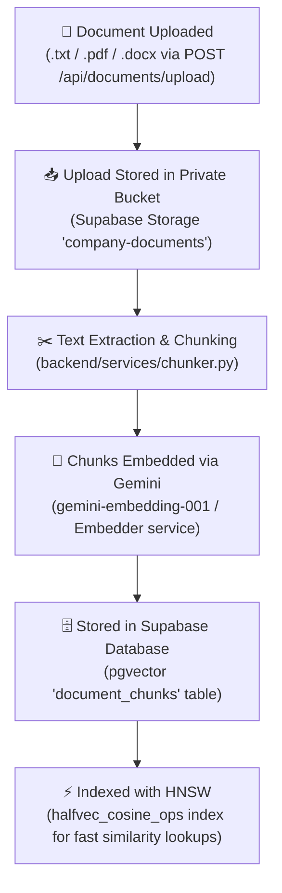
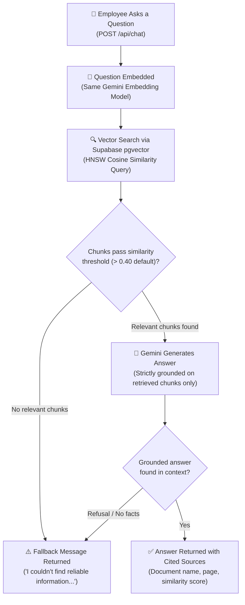
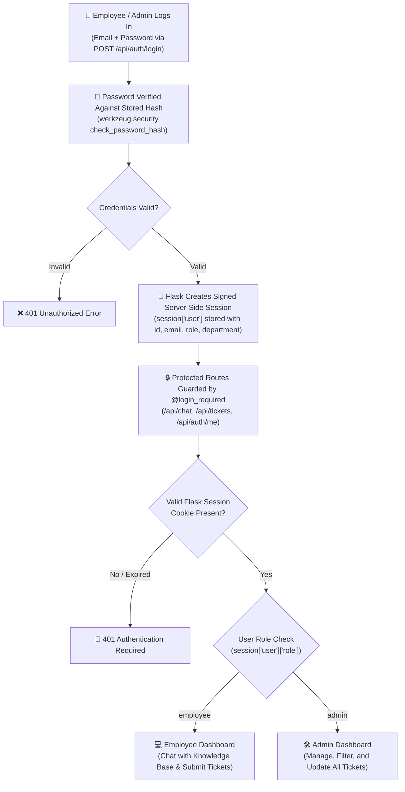

# DeskAI System Architecture & Technical Workflows

This document outlines the core architectural flows of the **DeskAI** platform, covering document ingestion, question-answering via Retrieval-Augmented Generation (RAG), and server-side session authentication.

---

## 1. Document Ingestion Flow

The ingestion pipeline processes company knowledge documents (`.pdf`, `.docx`, `.txt`), chunks them into semantic passages, computes vector embeddings using Google Gemini, and indexes them in Supabase PostgreSQL using `pgvector` with an HNSW index.

### Ingestion Steps:
1. **Upload & Validation**: Document is received via `/api/documents/upload`, validated for format/size, and saved to Supabase Storage.
2. **Text Extraction**: Text is extracted page-by-page from PDF, DOCX, or TXT documents.
3. **Chunking**: Content is split into chunks with overlap for contextual integrity.
4. **Vector Embedding**: Each chunk is converted into high-dimensional vector representations using Google Gemini.
5. **Storage & Indexing**: Vector embeddings and chunk metadata are persisted into PostgreSQL using the `pgvector` extension and indexed using an HNSW (Hierarchical Navigable Small World) index for sub-millisecond vector similarity search.

---

## 2. Question & Answer Flow (RAG Pipeline)

When an employee submits a question, DeskAI performs vector similarity retrieval against indexed knowledge chunks and prompts Google Gemini with strict grounding instructions to ensure factual, hallucination-free answers with source citations.

### Retrieval & Generation Details:
1. **Embedding**: The employee's question is embedded using the identical Gemini embedding model used during document ingestion.
2. **Vector Similarity Search**: Cosine similarity is computed against all stored chunks via `pgvector` / HNSW index.
3. **Threshold Filtering**: Only chunks exceeding the strict similarity score threshold are selected. If no chunks qualify, a fallback message is immediately returned without making an unnecessary LLM generation call.
4. **Strict Grounding**: Gemini is invoked with temperature `0.0` and system instructions requiring answers to derive exclusively from the retrieved context.
5. **Output Delivery**: The user receives either a fully cited answer with source document references or a graceful fallback message.

---

## 3. Authentication Flow (Flask Server-Side Sessions)

DeskAI utilizes **Flask server-side signed sessions** (not stateless JWTs) to secure application state and protect API endpoints.

### Key Authentication Features:
- **Server-Side Session Storage**: Sessions are cryptographically signed using `FLASK_SECRET_KEY` and managed on the server via Flask's `session` object.
- **No JWT Tokens**: Authentication does not use JWT generation, bearer header tokens, or client-side token verification.
- **Route Protection**: The `@login_required` decorator validates `session.get('user')` on every protected endpoint (`/api/chat`, `/api/tickets`, etc.).
- **Role-Based Access Control (RBAC)**: Redirects and dashboard permissions are governed according to the verified user role (`employee` vs `admin`).
